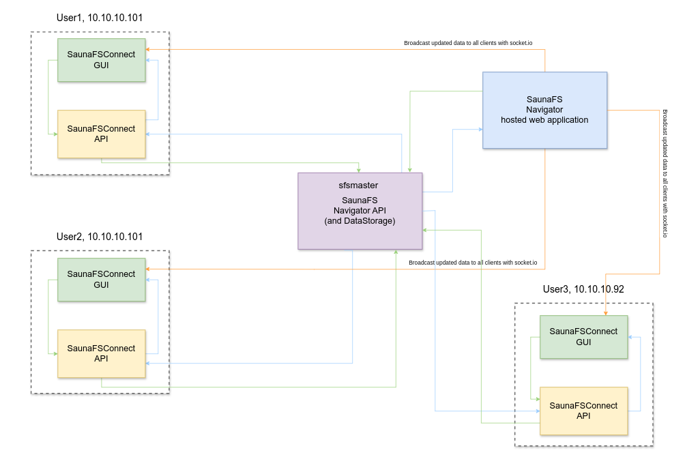

# **SaunaFS Project Suite** 🚀

Welcome to the **SaunaFS Project Suite**, a collection of tools designed to enhance and manage the **SaunaFS file system** and its Windows client. This suite consists of **four interconnected projects**, each serving a specific role.

---

## **🗂 Project Overview**  

| Project | Description |
|---------|------------|
| **saunafs-connect** | A **React + Electron desktop application** for Windows that acts as a wrapper for the SaunaFS Windows client and SaunaFS file system. |
| **saunafs-connect-api** | A **Node.js + Express API** deployed as a Windows service. This API provides backend functionality for `saunafs-connect`. |
| **saunafs-navigator** | A **React-based web application** for administrators to manage users, mount points, user groups, and other configurations. |
| **saunafs-navigator-api** | A **Node.js + Express API** that serves `saunafs-navigator` and also handles requests from `saunafs-connect-api`. It is the central data store for the system. |

---

## **🛠 How They Work Together**  

1. **Users run SaunaFSConnect** on their Windows machines, which consists of:
   - **SaunaFSConnect GUI** (React + Electron desktop app) for user interaction.
   - **SaunaFSConnect API** (Node.js + Express service) that communicates with the central SaunaFS system.

2. **SaunaFSConnect API** sends requests to **SaunaFS Navigator API (sfsmaster)**, which acts as the main backend storing user information, configurations, and access control settings.

3. **SaunaFS Navigator API** processes and stores data, ensuring all connected clients receive updates. It also interacts with the **SaunaFS Navigator (hosted web application)**, which serves as the admin panel.

4. **SaunaFS Navigator (hosted web application)** allows administrators to manage:
   - Users, mount points, and access groups.
   - System-wide configurations.
   - Real-time changes that propagate to all connected instances.

5. **Real-time Updates with Socket.io**:
   - Any changes made via the **SaunaFS Navigator web application** or **client interactions** are broadcasted to all connected clients using **Socket.io**.
   - This ensures that all users see up-to-date information across multiple machines.

6. **Multiple Clients (Users) Can Connect**:
   - Users on different machines (e.g., `User1, User2, User3`) each have their own SaunaFSConnect instance running.
   - They all communicate with the **central SaunaFS Navigator API**, ensuring synchronized data across all connected devices.

### **System Architecture Diagram**
Below is a schematic representation of how the SaunaFS projects interact:

---

## **📥 Installation & Setup**  

> 🚧 *Coming soon...* (Add instructions for setting up each project)

---

## **📡 API Documentation**  

> 📖 *Check out the API references:*  
- [saunafs-connect-api Docs](./saunafs-connect-api/README.md)  
- [saunafs-navigator-api Docs](./saunafs-navigator-api/README.md)  

---

## **🤝 Contributing**  

We welcome contributions! Please follow these steps:  
1. Fork the repository  
2. Create a new branch (`feature/new-feature`)  
3. Commit your changes  
4. Open a Pull Request  

---

## **📄 License**  

> 📝 *To be defined* (Add a license type, e.g., MIT, GPL)

---

## **📧 Contact & Support**  

For issues or questions, open an issue in the respective GitHub repository.  

---

## **🔗 Quick Links**  
- [SaunaFS Website](#) *(Add the real link if applicable)*  
- [SaunaFS Documentation](#) *(If there’s external documentation available)*  

---

### **Next Steps**  
Would you like me to add more details, such as **installation steps, API routes, or example usage**? Let me know! 🚀
